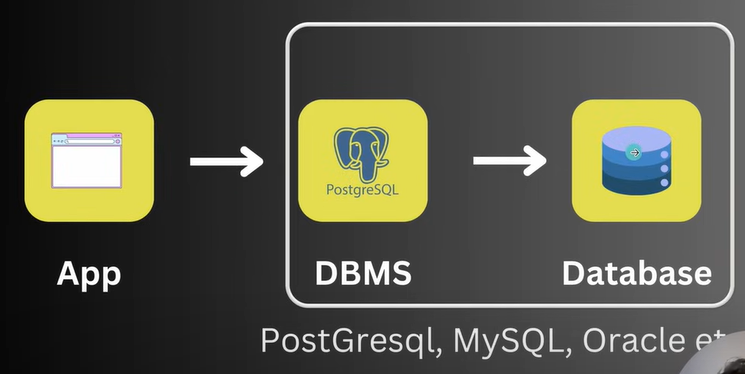
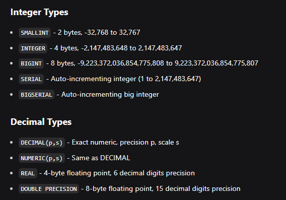
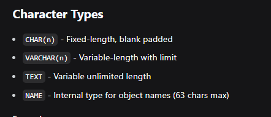
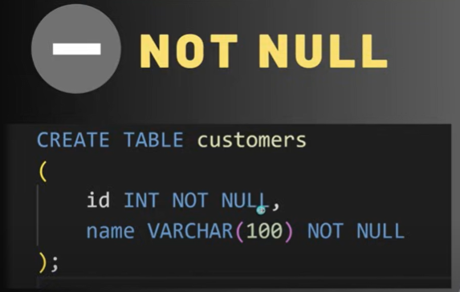
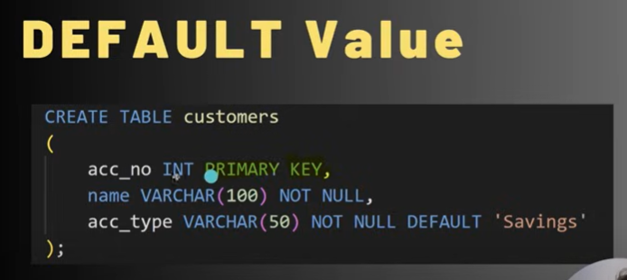
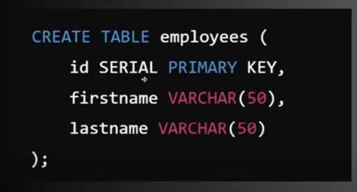
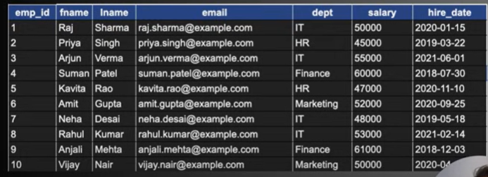
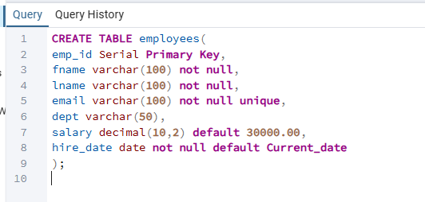
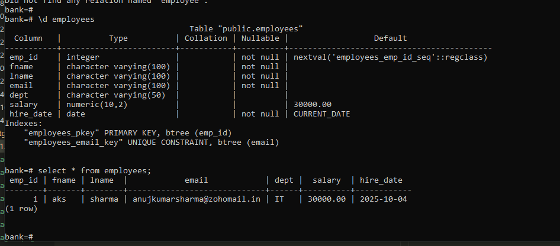
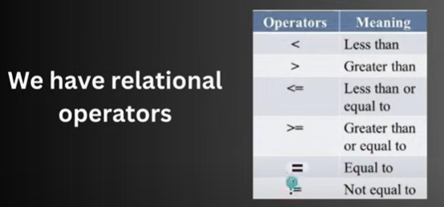

# Postgre SQL
link:- https://www.postgresql.org/docs/18/index.html
## Chapter 1

#### what is a Database?
- an organised collection of data.
- a method  to manipulate and access the data.

#### database vs DBMS
- database can be excel etc to store values.
- DBMS is database + how to access data like pSQL,mySQl languages.

#### RDBMS - A type of database system that stores data in structured tables (using rows and columns) and uses SQL for managing and querying Data.
 
#### The Hierarchy: Database → Schema → Table
- Think of it like this:
- Database = A building
- Schema = An apartment in that building
- Table = Furniture in that apartment

#### DATABASE
##### can you uppercase or lowercase

- list down existing database - Select datname FROM pg_database; , cmd - /l
- create database - create database test;
- change database - \c <database_name>;
- delete database - drop database <database_name>;

#### CURD
##### table - it is a collection of related  data held  in a table  format  within a database.

- creating a new table - create  table person(id INT, name varchar(100), city varchar(50));
- adding data into a table -
    -  insert into student(id,name,city) values(101,'aks','Rourkela');
    -  insert into student(id,name,city) values(101,'aks','Rourkela'),(102,'mohit','rourkela'); // for inserting multiple  data
    -  insert into student values(101,'aks','Rourkela'); // for single and inserting all fields(columns).
     
- Reading  data from a table 
    - select * from <table_name>
    - select <column_name> from students;
    - select <column_name>,<column_name> from <table_name>; // for multiple column

- Modify/update data from a table
    - udpate <table_name> set city='Delhi' where id=2;

- Deleting data
    - delete from <table_name> where id=1;

#### Datatypes

#### Constraint - it is a rule applied to column like unqiue etc.

#### Primary Key -
    - this constraint uniquely identifies each record in a table.
    - it must contain unique values, cannot contain NULL values.
    - A table can have only ONE primary key.

#### not null

#### Default value

#### auto_increment - (serial,bigserial)

#### Example - Employee Database
    lets see how to make it.

- 1 create table 
- 2 insert data - insert into employees values(1,'aks','sharma','anujkumarsharma@zohomail.in','IT'
); 
####
    -> if we have set serial in a column so do not enter data for that column let it auto handle it.
    -> if we have insert the data(id) for serial column then reset the sequence to max(id)+1.
    -> \d employees see the variable name like in picture
    -> to see the val - select currval('varName');.
    -> -> then set val -  select setval('employees_emp_id_seq',3);
    ->3 is max id values you can like check the val from your data and then update.
    ->so the issue was like the sequence(variable) was set inital to like 1 so when we insert data with 1 and then with out data(id) it show error as data with id 1 already exist right so for that we need to reset the sequence(variable).
- we can use

- logical operator like :- and , or.
- in and nor in operator : - 
    - examples:
        - select * from  employees where dept IN('It','Hr','Finance');
        - select * from  employees where dept NOT IN('IT','HR','Finance');
- Between :-
    - examples:
        - select * from employees where salary BETWEEN 40000 AND 65000;

### Clauses
    - where :- Examples
        - select * from employees where emp_id=1;
        - select * from employees where emp_id>4;
        - select * from employees where dept='IT';
        - select * from employees where dept='IT' or dept='Hr';
    - Distinct means unique values :- Examples
        -  select distinct dept from employees;
    - Order By (sort data):- Examples
        - select * from employees Order by fname; (default ascending order)
        - select * from employees Order by fname DESC; (descending order)
    - Limit :- Examples
        - select * from  employees LIMIT 3;
    - Like (start with alphabet or end etc):- Examples
        -   select * from employees where fname LIKE 'A%'; (name start with a)
        -   select * from employees where fname LIKE '%A'; (name end with a)
        -   select * from employees where fname LIKE '%i%'; (name where i comes in between not at start or end)
        -   select * from employees where dept LIKE '__'; (_ means one character, so here it give data where dept has only 2 character like it,hr etc)
        -   select * from employees where fname LIKE '_a%'; (here first char can we anything then second should be a and rest anything);

