# natural vs artificial intilegence

# brief history of ai

can machine think? turing test in 1950

ai winter

2005 deep learimg paper

2011 ibm waston win quiz
2012  deep neural network
 2017 google brain team - tramsform
 2018 gpt series

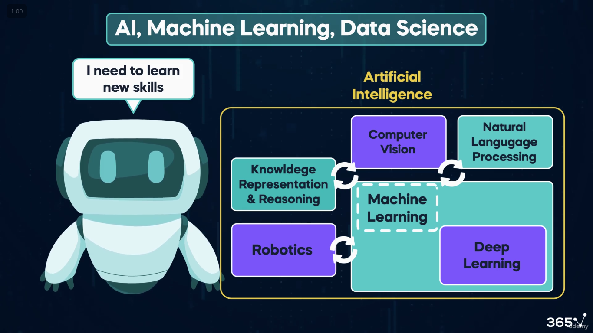
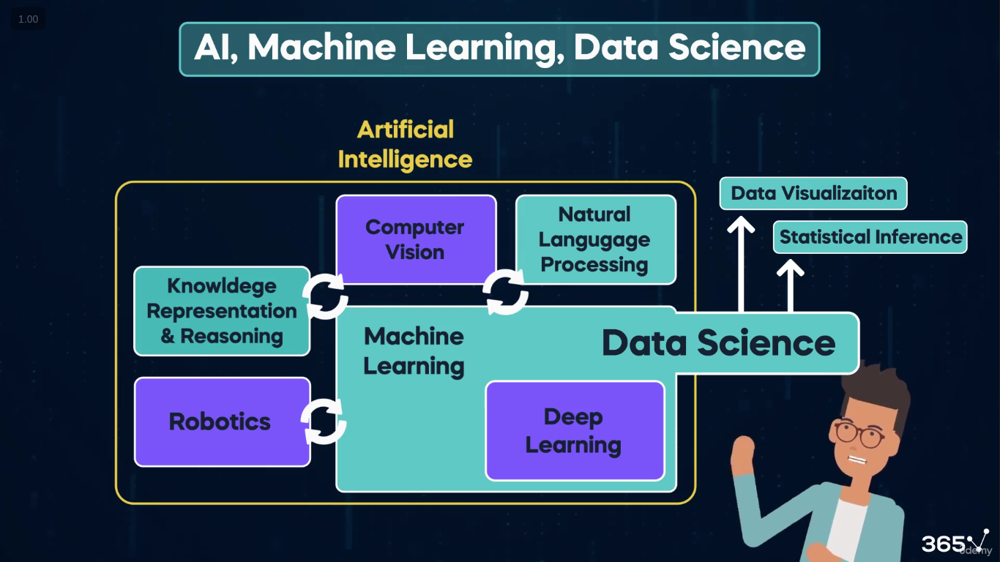

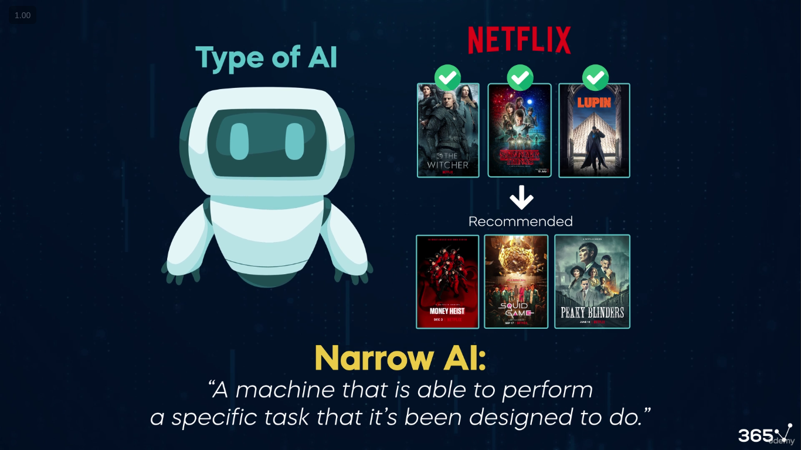

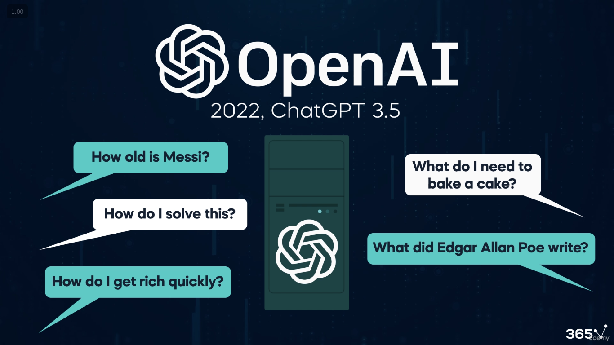
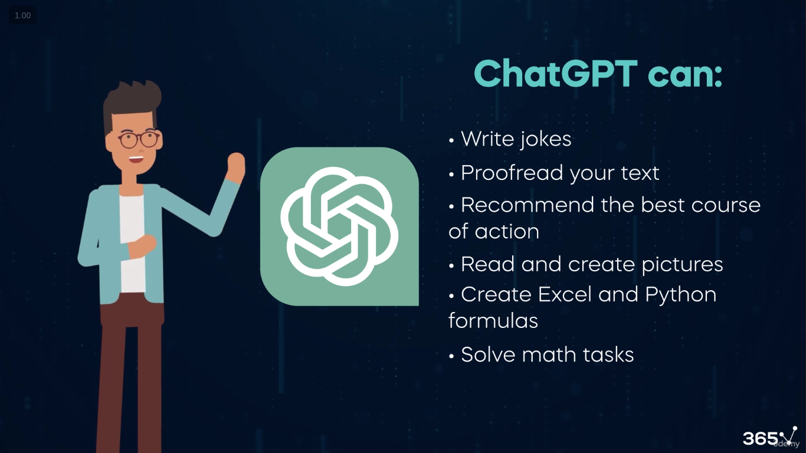
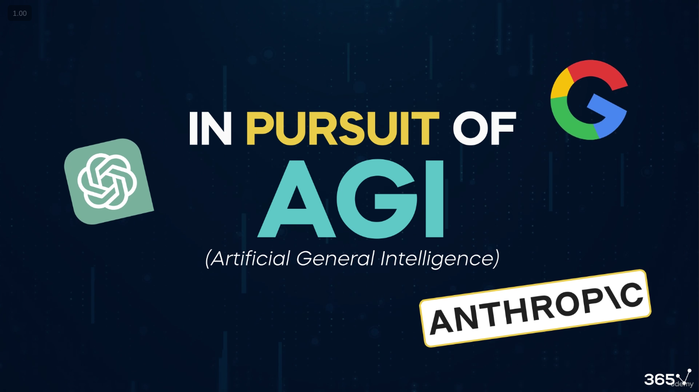
narow ai vs strong ai

struture vs unstruture data
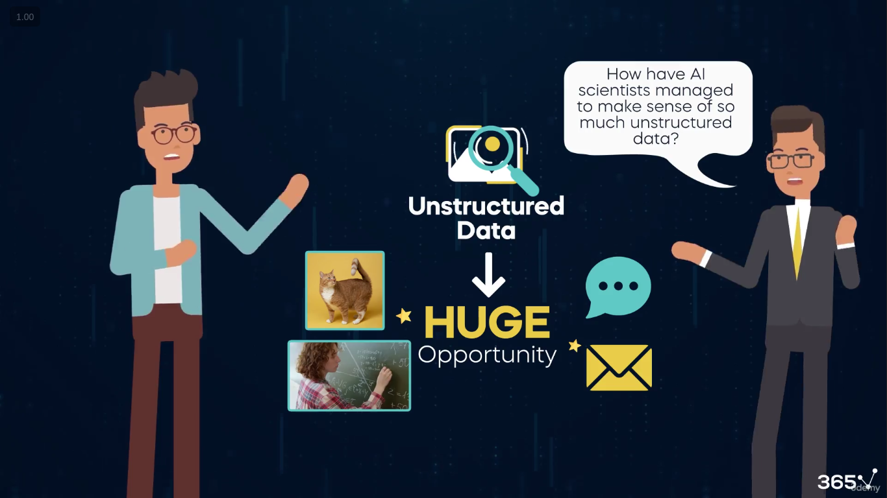

ai recognis image as image is also in pixwl 0 to 255 for text 
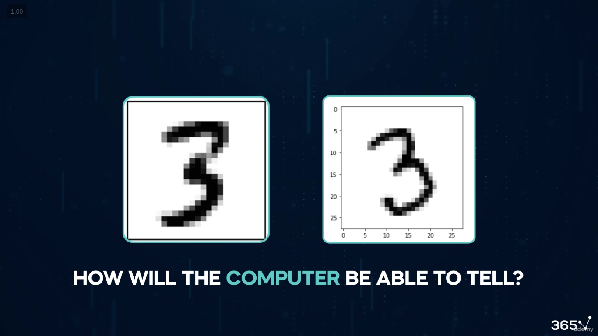

label and unlabel data
meta data

machine learning

supervised, unsupervised, reinforcement learning

deep learning
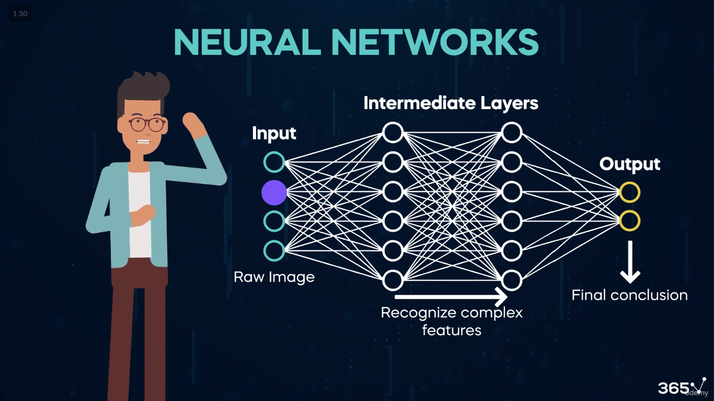
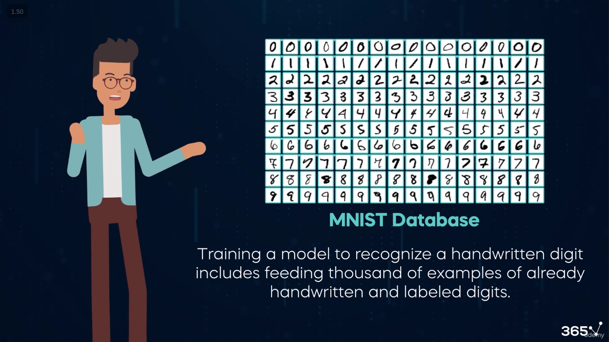
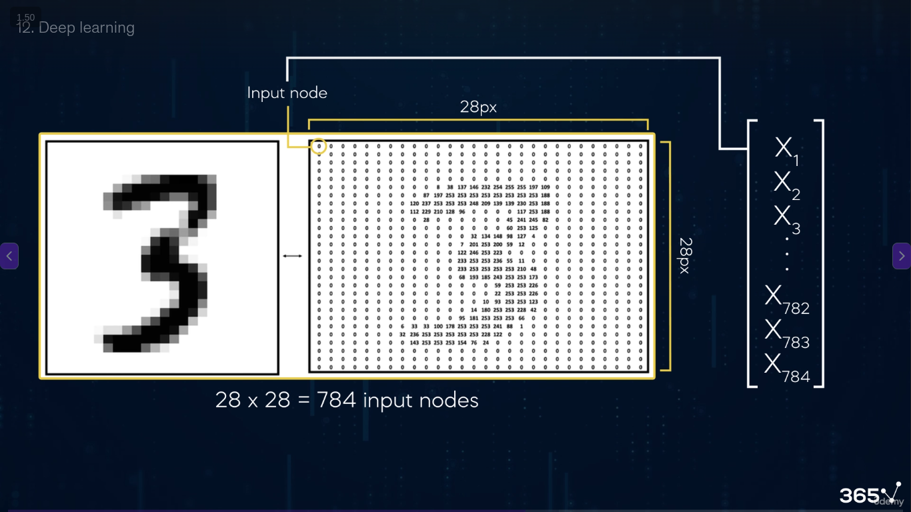
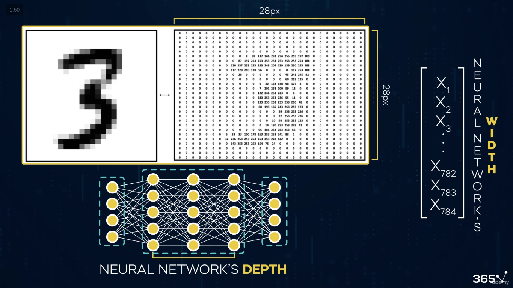

robotics

computer vison
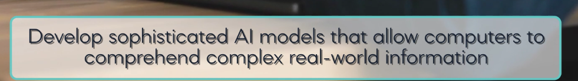
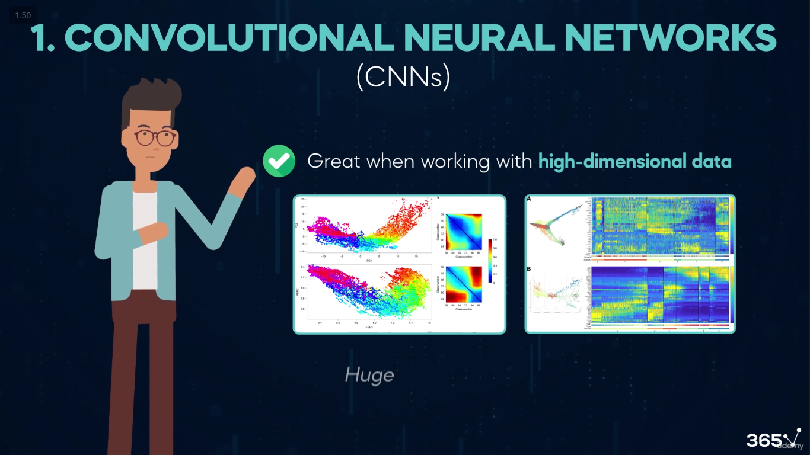
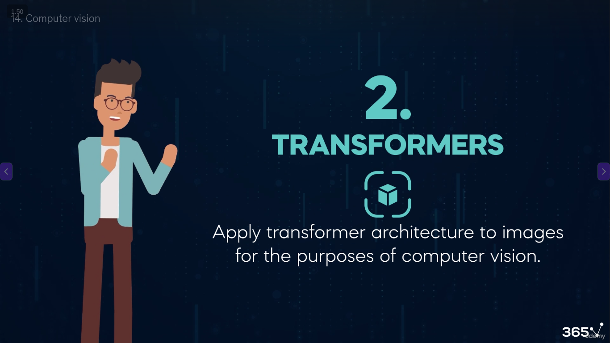
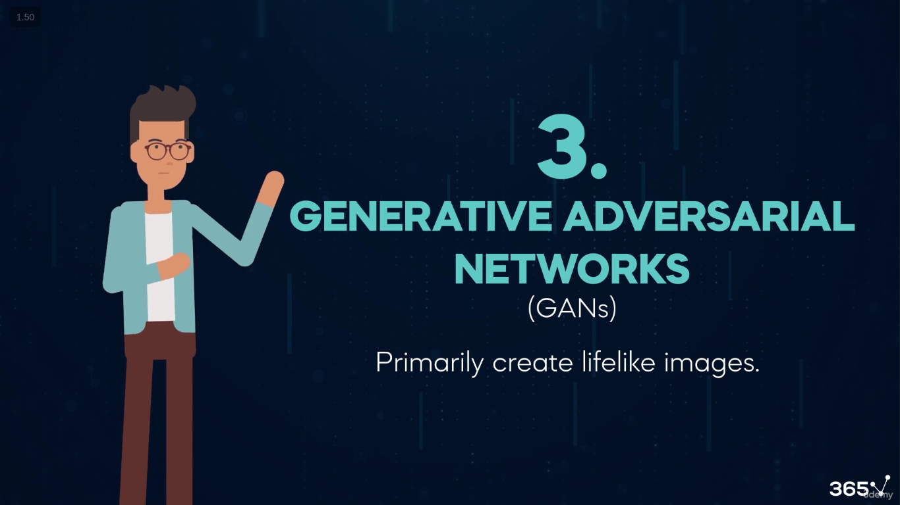
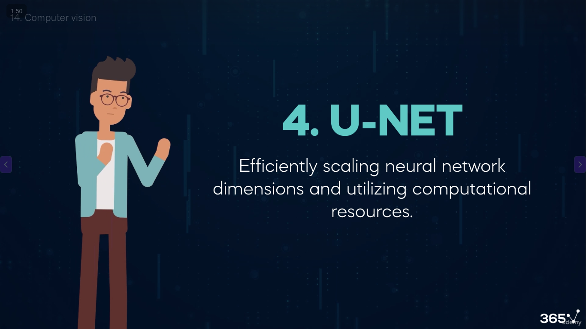

traditional ai
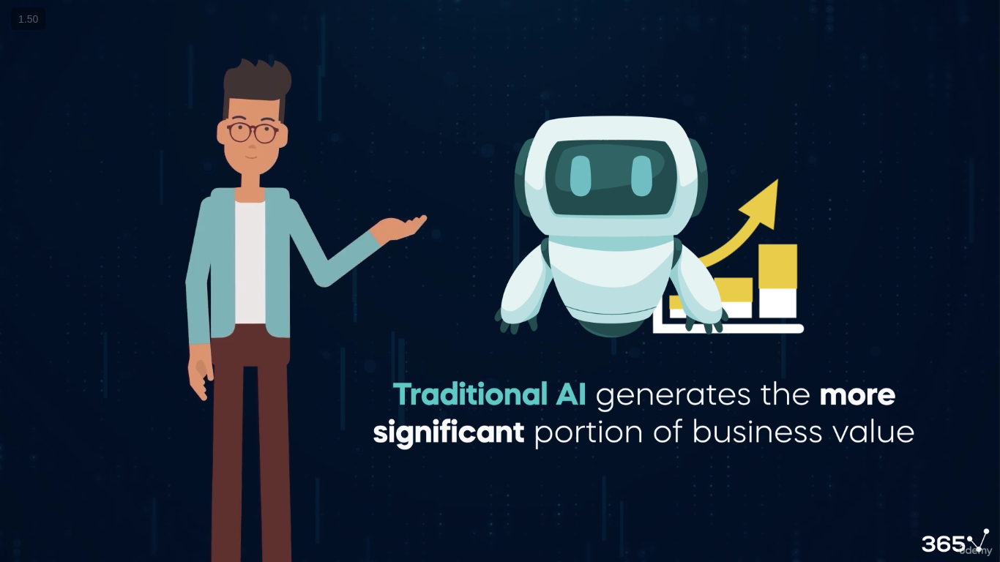
