# Cloud Computing & DevOps – Revision Notes

## What is DevOps?
DevOps is a set of practices that combines **software development (Dev)** and **IT operations (Ops)**. Its goal is to shorten the development life cycle and provide continuous delivery of high‑quality software.

### Key pillars of DevOps
1. **Continuous Deployment** – Automatically deploy every code change that passes automated tests to production.
2. **Automation** – Automate repetitive tasks (building, testing, deploying, infrastructure provisioning).
3. **Code Quality** – Enforce standards, static analysis, peer reviews, and automated testing to catch bugs early.
4. **Monitoring & Observability** – Track application performance, logs, metrics, and alerts to detect and fix issues in real time.

> 💡 **Why DevOps exists** – Traditional silos between developers and operations led to slow releases, finger‑pointing, and manual errors. DevOps aligns people, processes, and tools to deliver value faster and more reliably.

---

## DevOps vs Old (Traditional) System

### Old System (Waterfall / Siloed)
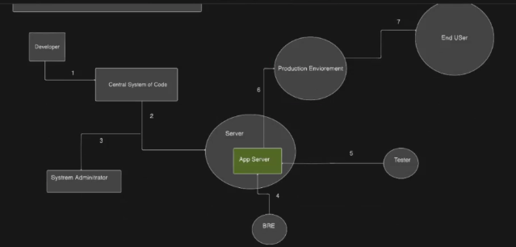  
*Characteristics:*  
- Dev writes code → throws it over the wall to Ops.  
- Manual deployment, long release cycles (months).  
- Error‑prone, hard to roll back.  
- Ops often discovers environment issues too late.

### New System (DevOps)
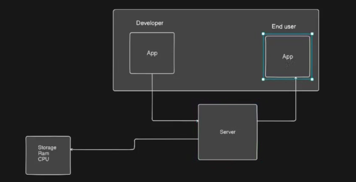  
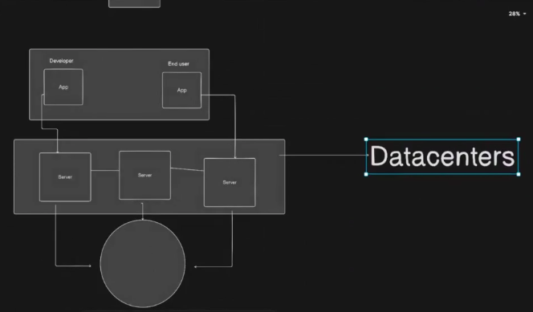  
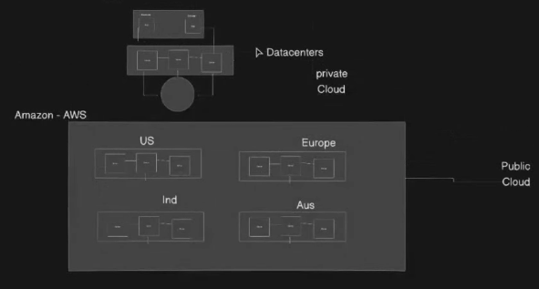  
*Characteristics:*  
- Shared responsibility, continuous integration & delivery (CI/CD).  
- Infrastructure as Code (IaC) – servers, networks, and storage are defined in code.  
- Automated testing, deployment, and monitoring.  
- Faster feedback loops and higher stability.

---

## What is Cloud Computing?
**Cloud computing** is the on‑demand delivery of IT resources (compute, storage, databases, networking) over the internet with pay‑as‑you‑go pricing. You don’t own the physical hardware; you rent it from a cloud provider.

### Main deployment models
| Model | Description |
|-------|-------------|
| **Public cloud** | Services offered over the public internet by providers like AWS, Azure, GCP. Shared infrastructure, but your data/logic is isolated. |
| **Private cloud** | Cloud environment dedicated solely to one organisation (on‑premises or hosted by a third party). More control, less scalability. |
| **Hybrid cloud** | Combination of public + private clouds, allowing data and apps to move between them (e.g., burst to public cloud for extra capacity). |
| **Multi‑cloud** | Using two or more public cloud providers simultaneously to avoid vendor lock‑in or for best‑of‑breed services. |

### Why cloud computing exists
- **Eliminate upfront infrastructure costs** – no need to buy servers.  
- **Elasticity** – scale up/down automatically based on demand.  
- **Global reach** – deploy near users anywhere.  
- **Reliability** – built‑in redundancy and disaster recovery.  
- **Focus on code** – operators manage the hardware, you focus on applications.

---

## The Relationship Between DevOps and Cloud Computing

| Aspect | How they work together |
|--------|------------------------|
| **Automation** | Cloud APIs enable scripted provisioning (Terraform, CloudFormation). DevOps pipelines call these APIs to create/destroy environments on the fly. |
| **Continuous Deployment** | Cloud provides managed CI/CD services (AWS CodePipeline, Azure DevOps, GitHub Actions) and deployment targets (Kubernetes, serverless). |
| **Monitoring** | Cloud services (CloudWatch, Azure Monitor, GCP Operations) feed logs/metrics directly into DevOps dashboards (Prometheus, Grafana, Datadog). |
| **Scalability** | Cloud auto‑scaling groups ensure apps handle load without manual ops intervention – a core DevOps goal. |
| **Infrastructure as Code (IaC)** | Cloud resources are defined in declarative files (e.g., YAML) and versioned alongside application code. The same DevOps tooling (Git, CI) manages both. |

> 🔁 **Why both exist together** – Cloud provides the **on‑demand, programmable infrastructure** that makes DevOps practices (like automated deployment and dynamic scaling) truly effective. Conversely, DevOps provides the **automation and culture** needed to manage cloud environments at scale. They reinforce each other.

---

## Quick Revision Table – Key Terms

| Term | One‑line definition |
|------|----------------------|
| DevOps | Dev + Ops collaboration using automation and monitoring to deliver software continuously. |
| Continuous Deployment | Every code change that passes tests is automatically released to production. |
| Infrastructure as Code | Managing infrastructure (networks, VMs, load balancers) using code and version control. |
| Public Cloud | Third‑party provider delivers services over the internet, shared but isolated. |
| Hybrid Cloud | Mix of on‑premises (private) and public cloud. |
| Multi‑cloud | Using multiple public cloud providers (e.g., AWS + Azure). |

# Cloud Computing & DevOps – Revision Notes

## What is DevOps?
DevOps is a set of practices that combines **software development (Dev)** and **IT operations (Ops)**. Its goal is to shorten the development life cycle and provide continuous delivery of high‑quality software.

### Key pillars of DevOps
1. **Continuous Deployment** – Automatically deploy every code change that passes automated tests to production.
2. **Automation** – Automate repetitive tasks (building, testing, deploying, infrastructure provisioning).
3. **Code Quality** – Enforce standards, static analysis, peer reviews, and automated testing to catch bugs early.
4. **Monitoring & Observability** – Track application performance, logs, metrics, and alerts to detect and fix issues in real time.

> 💡 **Why DevOps exists** – Traditional silos between developers and operations led to slow releases, finger‑pointing, and manual errors. DevOps aligns people, processes, and tools to deliver value faster and more reliably.

---

## What does a DevOps Engineer work on? (Day‑to‑day)

| Responsibility | What they actually do |
|----------------|------------------------|
| **CI/CD Pipelines** | Build & maintain pipelines (Jenkins, GitLab CI, GitHub Actions) that automatically build, test, and deploy code. |
| **Infrastructure as Code (IaC)** | Write Terraform, CloudFormation, or Pulumi scripts to provision servers, networks, databases. |
| **Configuration Management** | Use Ansible, Puppet, Chef to keep servers in a desired state (e.g., installed packages, config files). |
| **Containerisation & Orchestration** | Create Dockerfiles, manage Kubernetes clusters (EKS, AKS, GKE) for scaling microservices. |
| **Monitoring & Logging** | Set up Prometheus, Grafana, ELK stack, CloudWatch – create dashboards and alerts. |
| **Security & Compliance** | Implement secrets management (Vault, AWS Secrets Manager), scan images for vulnerabilities, enforce IAM roles. |
| **Collaboration** | Work with developers to optimise builds, with QA to automate tests, with security to embed “shift‑left” practices. |
| **Cloud Cost Optimisation** | Analyse cloud spend, right‑size instances, use spot instances, set budgets. |

---

## SDLC Concepts

### What is the Software Development Life Cycle (SDLC)?
The SDLC is a structured process used by development teams to design, build, test, deploy, and maintain high‑quality software.

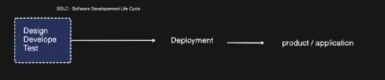

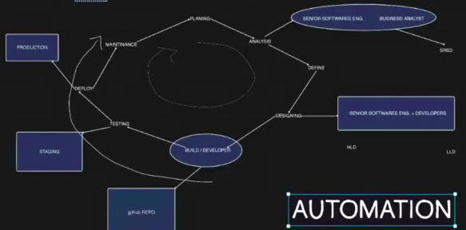

**Typical phases of SDLC** (and what a DevOps engineer does in each):

| Phase | DevOps involvement |
|-------|--------------------|
| **Planning** | Participate in sizing, define infrastructure needs, estimate cloud costs. |
| **Design (HLD/LLD)** | Help with high‑level & low‑level design decisions – e.g., microservices vs monolith, database selection, network topology. |
| **Development** | Provide local dev environments (Docker Compose, Vagrant), pre‑commit hooks for linting/testing. |
| **Testing** | Automate unit, integration, and end‑to‑end tests in CI pipelines; provision ephemeral test environments. |
| **Deployment** | Automate rollout (blue/green, canary), manage feature flags, auto rollbacks. |
| **Operation & Monitoring** | Set up observability stack, on‑call rotations, auto‑scaling, incident response. |
| **Maintenance** | Patch OS/images, rotate credentials, migrate data, handle deprecations without downtime. |

> 🔁 A DevOps engineer’s job is to **automate the whole SDLC process** – from code commit to production monitoring.

---

## Where DevOps and Cloud Computing fit in the SDLC Process

| SDLC Phase | How DevOps helps | How Cloud helps |
|------------|------------------|------------------|
| **Plan** | Version control all work (Git), track work items (Jira) | Estimate cloud costs with pricing calculators |
| **Design** | Infrastructure design reviewed as code (IaC) | Use managed services (RDS, S3, Lambda) to reduce ops burden |
| **Develop** | Local containerised dev environment matches production | Cloud dev environments (GitHub Codespaces, Cloud9) |
| **Test** | Automated testing in CI pipeline | Spin up test environments on demand (cheap, fast) |
| **Deploy** | CI/CD pipeline deploys after tests pass | Blue/green, canary deployments using load balancers |
| **Operate** | Centralised logging & monitoring dashboards | Auto‑scaling groups, serverless (no server to manage) |
| **Maintain** | Infrastructure as Code makes changes repeatable & auditable | Cloud snapshots, disaster recovery across regions |

---

## How DevOps and Cloud accelerate software delivery

| Challenge before | With DevOps + Cloud |
|------------------|----------------------|
| Provisioning servers takes weeks | Cloud – minutes with IaC |
| Manual testing & deployment (error prone) | Automated CI/CD pipelines |
| Environment drift (dev ≠ prod) | Immutable infrastructure, containerisation |
| Hard to scale for peak traffic | Auto‑scaling, load balancers |
| Long lead time to fix bugs | Continuous monitoring + fast rollback |
| High upfront hardware cost | Pay‑as‑you‑go, no waste |

> 📈 **Result** – Deployment frequency increases, lead time for changes drops from months to hours, recovery time from failures is seconds/minutes.

---

## CI / CD / Continuous Deployment – Clear Definitions

| Term | Meaning |
|------|---------|
| **CI (Continuous Integration)** | Developers **push code to GitHub** (or any Git repo) frequently. Each push triggers an automated build and test. This catches integration issues early. |
| **CD (Continuous Delivery)** | The code is automatically **built, tested, and packaged** – ready for deployment. A manual approval step may exist before going to production. |
| **Continuous Deployment** | Every change that passes all tests is **automatically deployed** to production without human intervention. (The “CD” in DevOps often refers to this.) |

**Simple flow:**

devops enginer work , dev team, ops, test team 
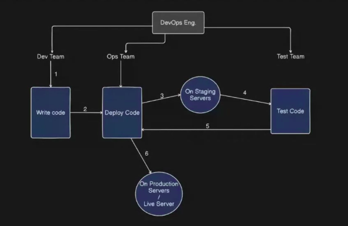

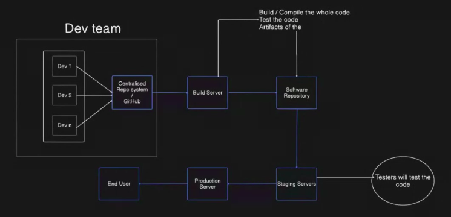
Ci , CD , C Deployment
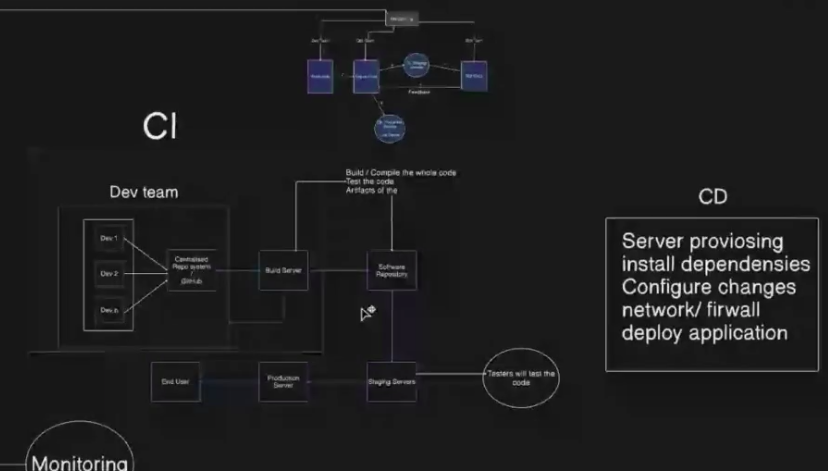
more better pipeline
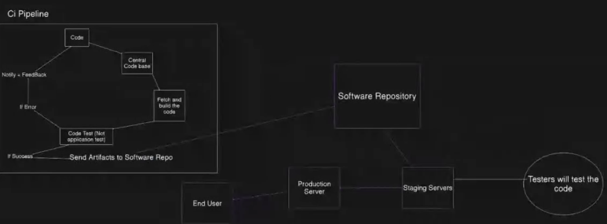

cloud computing -
key services: Iaas, Saas, Paas
 on premises vs cloud

on premises
 maintence, data recovery, security, scalling

 hardware part - server, storage hardware
 software part - os,database,env

cloud opposite
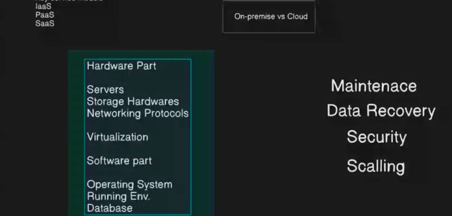

vitualization - hypervisor , 
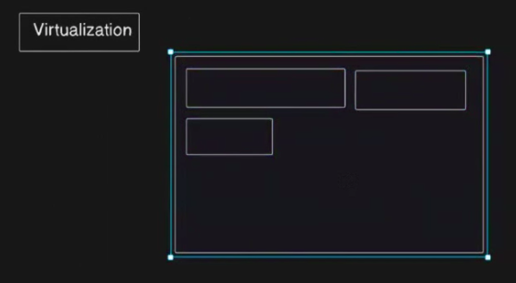
