# Cloud Computing & DevOps – Revision Notes

## What is DevOps?
DevOps is a set of practices that combines **software development (Dev)** and **IT operations (Ops)**. Its goal is to shorten the development life cycle and provide continuous delivery of high‑quality software.

### Key pillars of DevOps
1. **Continuous Deployment** – Automatically deploy every code change that passes automated tests to production.
2. **Automation** – Automate repetitive tasks (building, testing, deploying, infrastructure provisioning).
3. **Code Quality** – Enforce standards, static analysis, peer reviews, and automated testing to catch bugs early.
4. **Monitoring & Observability** – Track application performance, logs, metrics, and alerts to detect and fix issues in real time.

> 💡 **Why DevOps exists** – Traditional silos between developers and operations led to slow releases, finger‑pointing, and manual errors. DevOps aligns people, processes, and tools to deliver value faster and more reliably.

---

## DevOps vs Old (Traditional) System

### Old System (Waterfall / Siloed)
  
*Characteristics:*  
- Dev writes code → throws it over the wall to Ops.  
- Manual deployment, long release cycles (months).  
- Error‑prone, hard to roll back.  
- Ops often discovers environment issues too late.

### New System (DevOps)
  
  
  
*Characteristics:*  
- Shared responsibility, continuous integration & delivery (CI/CD).  
- Infrastructure as Code (IaC) – servers, networks, and storage are defined in code.  
- Automated testing, deployment, and monitoring.  
- Faster feedback loops and higher stability.

---

## What is Cloud Computing?
**Cloud computing** is the on‑demand delivery of IT resources (compute, storage, databases, networking) over the internet with pay‑as‑you‑go pricing. You don’t own the physical hardware; you rent it from a cloud provider.

### Main deployment models
| Model | Description |
|-------|-------------|
| **Public cloud** | Services offered over the public internet by providers like AWS, Azure, GCP. Shared infrastructure, but your data/logic is isolated. |
| **Private cloud** | Cloud environment dedicated solely to one organisation (on‑premises or hosted by a third party). More control, less scalability. |
| **Hybrid cloud** | Combination of public + private clouds, allowing data and apps to move between them (e.g., burst to public cloud for extra capacity). |
| **Multi‑cloud** | Using two or more public cloud providers simultaneously to avoid vendor lock‑in or for best‑of‑breed services. |

### Why cloud computing exists
- **Eliminate upfront infrastructure costs** – no need to buy servers.  
- **Elasticity** – scale up/down automatically based on demand.  
- **Global reach** – deploy near users anywhere.  
- **Reliability** – built‑in redundancy and disaster recovery.  
- **Focus on code** – operators manage the hardware, you focus on applications.

---

## The Relationship Between DevOps and Cloud Computing

| Aspect | How they work together |
|--------|------------------------|
| **Automation** | Cloud APIs enable scripted provisioning (Terraform, CloudFormation). DevOps pipelines call these APIs to create/destroy environments on the fly. |
| **Continuous Deployment** | Cloud provides managed CI/CD services (AWS CodePipeline, Azure DevOps, GitHub Actions) and deployment targets (Kubernetes, serverless). |
| **Monitoring** | Cloud services (CloudWatch, Azure Monitor, GCP Operations) feed logs/metrics directly into DevOps dashboards (Prometheus, Grafana, Datadog). |
| **Scalability** | Cloud auto‑scaling groups ensure apps handle load without manual ops intervention – a core DevOps goal. |
| **Infrastructure as Code (IaC)** | Cloud resources are defined in declarative files (e.g., YAML) and versioned alongside application code. The same DevOps tooling (Git, CI) manages both. |

> 🔁 **Why both exist together** – Cloud provides the **on‑demand, programmable infrastructure** that makes DevOps practices (like automated deployment and dynamic scaling) truly effective. Conversely, DevOps provides the **automation and culture** needed to manage cloud environments at scale. They reinforce each other.

---

## Quick Revision Table – Key Terms

| Term | One‑line definition |
|------|----------------------|
| DevOps | Dev + Ops collaboration using automation and monitoring to deliver software continuously. |
| Continuous Deployment | Every code change that passes tests is automatically released to production. |
| Infrastructure as Code | Managing infrastructure (networks, VMs, load balancers) using code and version control. |
| Public Cloud | Third‑party provider delivers services over the internet, shared but isolated. |
| Hybrid Cloud | Mix of on‑premises (private) and public cloud. |
| Multi‑cloud | Using multiple public cloud providers (e.g., AWS + Azure). |

# Cloud Computing & DevOps – Revision Notes

## What is DevOps?
DevOps is a set of practices that combines **software development (Dev)** and **IT operations (Ops)**. Its goal is to shorten the development life cycle and provide continuous delivery of high‑quality software.

### Key pillars of DevOps
1. **Continuous Deployment** – Automatically deploy every code change that passes automated tests to production.
2. **Automation** – Automate repetitive tasks (building, testing, deploying, infrastructure provisioning).
3. **Code Quality** – Enforce standards, static analysis, peer reviews, and automated testing to catch bugs early.
4. **Monitoring & Observability** – Track application performance, logs, metrics, and alerts to detect and fix issues in real time.

> 💡 **Why DevOps exists** – Traditional silos between developers and operations led to slow releases, finger‑pointing, and manual errors. DevOps aligns people, processes, and tools to deliver value faster and more reliably.

---

## What does a DevOps Engineer work on? (Day‑to‑day)

| Responsibility | What they actually do |
|----------------|------------------------|
| **CI/CD Pipelines** | Build & maintain pipelines (Jenkins, GitLab CI, GitHub Actions) that automatically build, test, and deploy code. |
| **Infrastructure as Code (IaC)** | Write Terraform, CloudFormation, or Pulumi scripts to provision servers, networks, databases. |
| **Configuration Management** | Use Ansible, Puppet, Chef to keep servers in a desired state (e.g., installed packages, config files). |
| **Containerisation & Orchestration** | Create Dockerfiles, manage Kubernetes clusters (EKS, AKS, GKE) for scaling microservices. |
| **Monitoring & Logging** | Set up Prometheus, Grafana, ELK stack, CloudWatch – create dashboards and alerts. |
| **Security & Compliance** | Implement secrets management (Vault, AWS Secrets Manager), scan images for vulnerabilities, enforce IAM roles. |
| **Collaboration** | Work with developers to optimise builds, with QA to automate tests, with security to embed “shift‑left” practices. |
| **Cloud Cost Optimisation** | Analyse cloud spend, right‑size instances, use spot instances, set budgets. |

---

## SDLC Concepts

### What is the Software Development Life Cycle (SDLC)?
The SDLC is a structured process used by development teams to design, build, test, deploy, and maintain high‑quality software.


**Typical phases of SDLC** (and what a DevOps engineer does in each):

| Phase | DevOps involvement |
|-------|--------------------|
| **Planning** | Participate in sizing, define infrastructure needs, estimate cloud costs. |
| **Design (HLD/LLD)** | Help with high‑level & low‑level design decisions – e.g., microservices vs monolith, database selection, network topology. |
| **Development** | Provide local dev environments (Docker Compose, Vagrant), pre‑commit hooks for linting/testing. |
| **Testing** | Automate unit, integration, and end‑to‑end tests in CI pipelines; provision ephemeral test environments. |
| **Deployment** | Automate rollout (blue/green, canary), manage feature flags, auto rollbacks. |
| **Operation & Monitoring** | Set up observability stack, on‑call rotations, auto‑scaling, incident response. |
| **Maintenance** | Patch OS/images, rotate credentials, migrate data, handle deprecations without downtime. |

> 🔁 A DevOps engineer’s job is to **automate the whole SDLC process** – from code commit to production monitoring.

---

## Where DevOps and Cloud Computing fit in the SDLC Process

| SDLC Phase | How DevOps helps | How Cloud helps |
|------------|------------------|------------------|
| **Plan** | Version control all work (Git), track work items (Jira) | Estimate cloud costs with pricing calculators |
| **Design** | Infrastructure design reviewed as code (IaC) | Use managed services (RDS, S3, Lambda) to reduce ops burden |
| **Develop** | Local containerised dev environment matches production | Cloud dev environments (GitHub Codespaces, Cloud9) |
| **Test** | Automated testing in CI pipeline | Spin up test environments on demand (cheap, fast) |
| **Deploy** | CI/CD pipeline deploys after tests pass | Blue/green, canary deployments using load balancers |
| **Operate** | Centralised logging & monitoring dashboards | Auto‑scaling groups, serverless (no server to manage) |
| **Maintain** | Infrastructure as Code makes changes repeatable & auditable | Cloud snapshots, disaster recovery across regions |

---

## How DevOps and Cloud accelerate software delivery

| Challenge before | With DevOps + Cloud |
|------------------|----------------------|
| Provisioning servers takes weeks | Cloud – minutes with IaC |
| Manual testing & deployment (error prone) | Automated CI/CD pipelines |
| Environment drift (dev ≠ prod) | Immutable infrastructure, containerisation |
| Hard to scale for peak traffic | Auto‑scaling, load balancers |
| Long lead time to fix bugs | Continuous monitoring + fast rollback |
| High upfront hardware cost | Pay‑as‑you‑go, no waste |

> 📈 **Result** – Deployment frequency increases, lead time for changes drops from months to hours, recovery time from failures is seconds/minutes.

---

## CI / CD / Continuous Deployment – Clear Definitions

| Term | Meaning |
|------|---------|
| **CI (Continuous Integration)** | Developers **push code to GitHub** (or any Git repo) frequently. Each push triggers an automated build and test. This catches integration issues early. |
| **CD (Continuous Delivery)** | The code is automatically **built, tested, and packaged** – ready for deployment. A manual approval step may exist before going to production. |
| **Continuous Deployment** | Every change that passes all tests is **automatically deployed** to production without human intervention. (The “CD” in DevOps often refers to this.) |

**Simple flow:**

Code change -> CI build/test -> package artifact -> deploy to staging -> approval/tests -> production deployment -> monitoring.

---

## DevOps Engineer Work With Different Teams


### DevOps Engineer
- Connects **Dev team, Test team, and Ops team**.
- Creates CI/CD pipelines for build, test, and deployment.
- Automates manual work using scripts, tools, and cloud services.
- Monitors application health after deployment.
- Helps fix deployment, server, and environment problems.

### Development Team
- Writes application code and pushes it to Git.
- Fixes bugs and adds new features.
- Works with DevOps to make code easy to build and deploy.

### Testing / QA Team
- Tests the application before release.
- Writes or runs automated test cases.
- Checks if new code breaks old features.
- Gives feedback before deployment.

### Operations Team
- Manages servers, networks, storage, and production systems.
- Handles uptime, backups, monitoring, and incidents.
- Works with DevOps to make production stable.

> Simple idea: **Dev builds, Test checks, Ops runs, DevOps connects and automates everything.**

---

## CI, CD, and Continuous Deployment


| Term | Simple meaning |
|------|----------------|
| **CI - Continuous Integration** | Developers push code often. The system automatically builds and tests the code. |
| **CD - Continuous Delivery** | Code is ready to deploy after build and test. Usually one manual approval is needed. |
| **Continuous Deployment** | Code automatically goes to production if all tests pass. No manual approval is needed. |

### Easy Difference
- **CI** = build + test automatically.
- **Continuous Delivery** = ready for release automatically.
- **Continuous Deployment** = released to users automatically.

---

## Better DevOps Pipeline


### Common Pipeline Steps
1. **Plan** - decide feature or bug fix.
2. **Code** - developer writes code.
3. **Commit** - code is pushed to Git.
4. **Build** - application package is created.
5. **Test** - automated tests run.
6. **Security Scan** - code and packages are checked for risk.
7. **Deploy** - application is released to staging or production.
8. **Monitor** - logs, metrics, and alerts are checked.

> A good pipeline reduces manual mistakes and gives fast feedback.

---

## Cloud Computing - Key Services

Cloud computing means using computing resources over the internet instead of buying and managing all hardware yourself.

### Main Service Models
| Service | Full form | Simple meaning | Example |
|---------|-----------|----------------|---------|
| **IaaS** | Infrastructure as a Service | Rent servers, storage, and networking. You manage OS and apps. | AWS EC2, Azure VM |
| **PaaS** | Platform as a Service | Provider manages server and runtime. You deploy your code. | Heroku, Google App Engine |
| **SaaS** | Software as a Service | Ready-made software used through browser/app. | Gmail, Google Drive, Salesforce |

---

## On-Premises vs Cloud


### On-Premises
On-premises means the company owns and manages its own servers in its own data center or office.

**Company is responsible for:**
- **Maintenance** - repairing and updating hardware/software.
- **Data recovery** - backups and disaster recovery setup.
- **Security** - physical security, firewall, access control.
- **Scaling** - buying and adding more servers when demand increases.

### Hardware Part
- Servers
- Storage hardware
- Network devices
- Physical data center space

### Software Part
- Operating system
- Database
- Runtime environment
- Application software

### Cloud
Cloud is mostly the opposite of on-premises:
- No need to buy physical servers.
- Cloud provider manages data centers and hardware.
- Easy to scale up or down.
- Pay only for what you use.
- Faster setup compared to traditional infrastructure.

---

## Virtualization and Hypervisor


### Virtualization
Virtualization means creating multiple **virtual machines** from one physical machine.

### Hypervisor
A hypervisor is software that creates and manages virtual machines.

**Example:**
One physical server can run:
- VM 1 - Linux server
- VM 2 - Windows server
- VM 3 - Database server

> Simple idea: **Virtualization helps use one physical server like many separate servers.**

---

## On-Premises Infrastructure


In on-premises infrastructure, the company controls almost everything:
- Physical building or server room.
- Servers and storage.
- Network and firewall.
- Operating systems.
- Databases.
- Application environment.
- Backup and recovery.

This gives more control, but it also needs more money, maintenance, and skilled staff.

---

## IaaS, PaaS, SaaS Responsibility

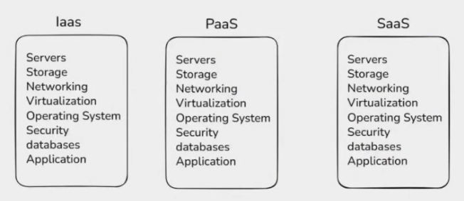

| Layer | On-Premises | IaaS | PaaS | SaaS |
|-------|-------------|------|------|------|
| Application | You manage | You manage | You manage | Provider manages |
| Data | You manage | You manage | You manage | Provider manages |
| Runtime | You manage | You manage | Provider manages | Provider manages |
| OS | You manage | You manage | Provider manages | Provider manages |
| Virtualization | You manage | Provider manages | Provider manages | Provider manages |
| Servers | You manage | Provider manages | Provider manages | Provider manages |
| Storage | You manage | Provider manages | Provider manages | Provider manages |
| Networking | You manage | Provider manages | Provider manages | Provider manages |

### Simple Memory Trick
- **IaaS** = provider gives infrastructure.
- **PaaS** = provider gives platform.
- **SaaS** = provider gives complete software.

---

## Why Linux is Important in Cloud

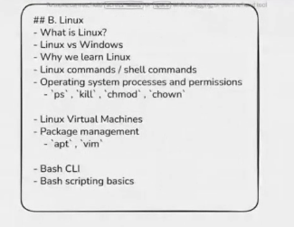

Linux is used heavily in cloud computing because it is stable, secure, flexible, and easy to automate.

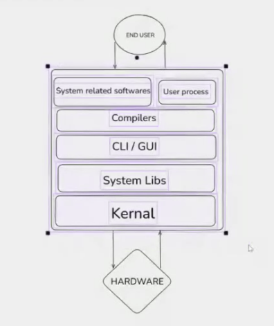

### Why Cloud Providers Use Linux
- **Open source** - companies can modify it for their own cloud systems.
- **Stable** - good for running servers 24/7.
- **Secure** - strong permission system and regular security updates.
- **Lightweight** - can run with fewer resources than many desktop operating systems.
- **Automation friendly** - works well with shell scripts, SSH, DevOps tools, and containers.
- **Best for servers** - most web servers, databases, and containers run on Linux.

> Simple idea: **Linux is the main server operating system used in cloud and DevOps.**

---

## Cloud Providers and Operating Systems

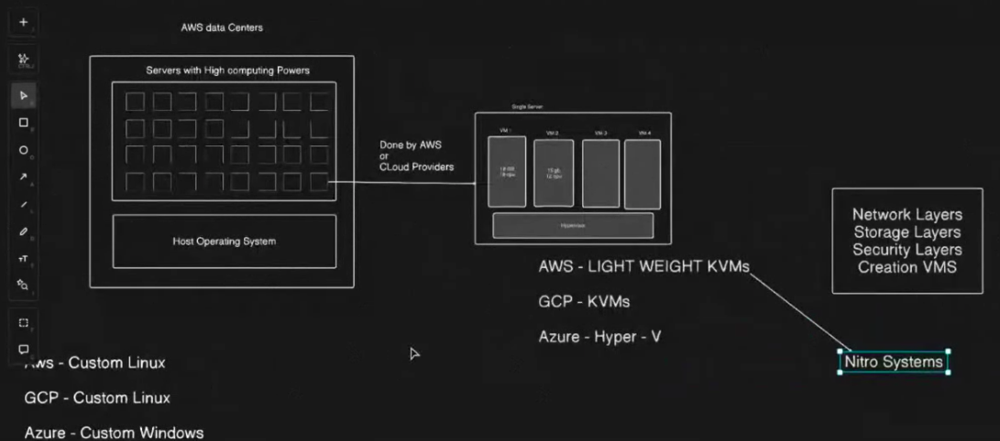

Different cloud providers use customized operating systems and virtualization technology internally.

| Cloud provider | Common virtualization base | Simple note |
|----------------|----------------------------|-------------|
| **AWS** | KVM-based virtualization with Nitro System | Uses lightweight virtualization and special hardware cards for better speed and security. |
| **Google Cloud / GCP** | KVM-based virtualization | Uses Linux/KVM technology for running virtual machines. |
| **Microsoft Azure** | Hyper-V based virtualization | Uses Microsoft Hyper-V technology, connected with Windows and Linux VM support. |

### Important Note
- AWS and Google use a lot of **custom Linux-based systems** inside their cloud.
- Azure is Microsoft cloud, so it uses **custom Windows/Hyper-V technology**, but it also runs Linux VMs very well.

---

## What Hypervisor Does

A **hypervisor** is the virtualization layer that creates and manages virtual machines.

### Main Work of Hypervisor
- **Create VMs** - divides one physical server into multiple virtual servers.
- **CPU management** - gives CPU power to each VM.
- **Memory management** - assigns RAM to each VM.
- **Network layer** - connects VMs to virtual/private nets.
- **Storage layer** - connects VMs to virtual disks and cloud storage.
- **Security layer** - isolates one VM from another VM.
- **Resource control** - prevents one VM from using all server resources.

> Simple idea: **Hypervisor sits between hardware and virtual machines.**

---

## AWS Nitro System

AWS Nitro System is AWS's modern virtualization system used for EC2 instances.

### Why AWS Nitro is Important
- Moves many virtualization tasks to special hardware cards.
- Improves VM performance because the main server CPU has less overhead.
- Improves security by isolating customers better.
- Handles networking, storage, and monitoring more efficiently.
- Allows AWS to provide faster and more lightweight EC2 instances.

### Easy Explanation
In older virtualization, the hypervisor did many jobs directly on the server CPU.  
In AWS Nitro, special Nitro cards handle many jobs like:
- Networking
- Storage
- Security
- Monitoring

So EC2 instances become faster, safer, and closer to real physical machine performance.

---

## Type 1 and Type 2 Hypervisor

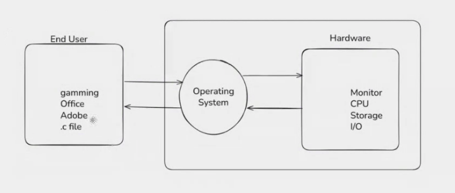

| Type | Also called | How it works | Example |
|------|-------------|--------------|---------|
| **Type 1 Hypervisor** | Bare-metal hypervisor | Runs directly on physical hardware. | VMware ESXi, Microsoft Hyper-V, KVM, Xen |
| **Type 2 Hypervisor** | Hosted hypervisor | Runs on top of an existing operating system. | VirtualBox, VMware Workstation |

### Type 1 Hypervisor
- Used in data centers and cloud platforms.
- Faster and more secure.
- Best for production servers.

### Type 2 Hypervisor
- Used mostly on laptops/desktops for practice and testing.
- Easy to install.
- Performance is lower because it depends on the host OS.

> Cloud providers mainly use **Type 1 hypervisors** because they need high performance and strong isolation.

---

## Linux Basics for Cloud and DevOps

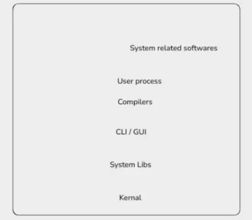

### Why DevOps Engineers Learn Linux
- Most cloud servers run Linux.
- Docker and Kubernetes are commonly used with Linux.
- CI/CD tools often run on Linux agents.
- Logs, services, permissions, and networking are managed using Linux commands.
- SSH is used to connect to remote Linux servers.

### Common Linux Skills
- File commands: `ls`, `cd`, `pwd`, `cp`, `mv`, `rm`
- Text commands: `cat`, `less`, `head`, `tail`, `grep`
- Permission commands: `chmod`, `chown`
- Process commands: `ps`, `top`, `kill`
- Service commands: `systemctl`, `journalctl`
- Network commands: `ping`, `curl`, `netstat`, `ss`

> Simple idea: **For DevOps, Linux is not optional. It is a daily tool.**

---

## Nested Virtualization

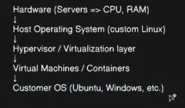

Nested virtualization means running a virtual machine **inside another virtual machine**.

### Simple Example
- Physical server runs a hypervisor.
- Hypervisor creates VM 1.
- Inside VM 1, we install another hypervisor.
- That inner hypervisor creates VM 2.

### Why Nested Virtualization is Used
- Practice cloud and virtualization concepts.
- Test hypervisors without buying physical servers.
- Run labs for DevOps, Kubernetes, OpenStack, and security testing.
- Create training environments inside cloud VMs.

### Important Point
Nested virtualization can be slower than normal virtualization because there are extra virtualization layers.

> Simple idea: **Nested virtualization = VM inside VM.**

---

## Why Cloud Providers Use Linux

Cloud providers use Linux because it is open source, stable, secure, and easy to customize.

### Main Reasons
- **Open source** - providers can modify Linux for their own cloud platform.
- **Low cost** - no license cost like many commercial operating systems.
- **Secure** - strong user permission and process isolation.
- **Stable** - good for servers running continuously.
- **Customizable** - easy to remove unnecessary parts and make it lightweight.
- **DevOps friendly** - works well with automation, shell scripting, containers, and CI/CD.

> AWS, Google Cloud, and many cloud services use heavily customized Linux-based systems internally.

---

## Basic Linux Commands

| Command | Use |
|---------|-----|
| `reboot` | Restart the machine. |
| `clear` | Clear the terminal screen. |
| `exit` | Exit from current shell/session. |
| `ip addr` | Show IP address and network interfaces. |
| `whoami` | Show current logged-in username. |
| `ls` | List files and folders. |
| `ls -l` | List files with more details like permissions, owner, size, and date. |
| `ls -lt` | List files sorted by latest modified first. |
| `ls -ltr` | List files sorted by oldest modified first. |

### Package Management Commands

| Command | Use |
|---------|-----|
| `sudo apt update` | Refresh package list from repositories. |
| `sudo apt upgrade` | Upgrade installed packages. |
| `sudo apt install python3` | Install Python 3. |
| `sudo apt remove python3` | Remove Python 3. |

### Important Difference
- `apt update` only updates the package list.
- `apt upgrade` upgrades the installed software.

---

## Sudo, Root User, and Normal User

### What is `sudo`?
`sudo` means **superuser do**. It allows a normal user to run commands with administrator/root permission.

### Root vs Normal User
| Symbol | Meaning |
|--------|---------|
| `$` | Normal user shell. |
| `#` | Root user shell. |

### Useful Commands
| Command | Use |
|---------|-----|
| `sudo -i` | Switch to root user shell. |
| `whoami` | Check which user you are currently using. |
| `exit` | Exit from root shell or SSH session. |

### Example
```bash
whoami
sudo -i
whoami
exit
```

> Use root carefully because root can change or delete important system files.

---

## SSH Basics

SSH means **Secure Shell**. It is used to connect to a remote Linux server securely.

### Why SSH is Used
- Login to cloud servers.
- Run Linux commands remotely.
- Manage EC2/VM instances.
- Copy files securely between machines.

### Install and Start SSH Server
```bash
sudo apt install openssh-server -y
sudo systemctl start ssh
sudo systemctl enable ssh
```

### Command Meaning
| Command | Use |
|---------|-----|
| `sudo apt install openssh-server -y` | Install SSH server. `-y` automatically answers yes during install. |
| `sudo systemctl start ssh` | Start SSH service now. |
| `sudo systemctl enable ssh` | Start SSH automatically after reboot. |

### Basic SSH Login Format
```bash
ssh username@server-ip
```

Example:
```bash
ssh ubuntu@192.168.1.10
```

> Simple idea: **SSH is the secure way to control Linux servers from another computer.**

---

## Linux Folder Structure

Linux file system starts from `/`, called the **root directory**. Everything in Linux is stored under `/`.

| Directory | Use |
|-----------|-----|
| `/` | Root directory. Starting point of the full Linux file system. |
| `/bin` | Essential user commands like `ls`, `cp`, `mv`, `cat`, `mkdir`. |
| `/sbin` | System administration commands like `reboot`, `shutdown`, `fdisk`. Mostly used by root/admin. |
| `/lib` | Important library files needed by commands and system programs. |
| `/etc` | Configuration files like users, groups, SSH config, network config. |
| `/home` | Home folders of normal users, like `/home/anuj`. |
| `/root` | Home folder of the root user. |
| `/var` | Variable data like logs, cache, mail, web files. Example: `/var/log`. |
| `/tmp` | Temporary files. Data here may be deleted automatically. |
| `/opt` | Optional third-party software installed manually. |
| `/usr` | User programs, libraries, documentation, and shared files. |
| `/dev` | Device files like disks, terminals, USB devices. |
| `/proc` | Virtual files showing running process and kernel information. |
| `/sys` | Virtual files showing hardware and kernel device information. |

> Note: You wrote `/str`, but the common important directory is usually `/usr`.

---

## User Management in Linux

Linux is a multi-user operating system. Many users can exist on the same server, and each user can have different permissions.

### Important User Files

| File | Use |
|------|-----|
| `/etc/passwd` | Stores user account information like username, UID, GID, home directory, and shell. |
| `/etc/shadow` | Stores encrypted password hashes and password aging information. Only root can read it. |
| `/etc/group` | Stores group information and group members. |

### View User and Group Files
```bash
cat /etc/passwd
cat /etc/shadow
cat /etc/group
```

---

## `useradd` vs `adduser`

| Command | Simple meaning |
|---------|----------------|
| `useradd` | Low-level command. Good for scripting. On many systems it does not create home folder unless `-m` is used. |
| `adduser` | Friendlier wrapper around `useradd` on Ubuntu/Debian. Usually asks questions and creates home folder by default. |

### Create User With `useradd`
```bash
sudo useradd -m -s /bin/bash username
```

| Option | Use |
|--------|-----|
| `-m` | Create user's home directory. |
| `-s /bin/bash` | Set login shell to Bash. |

### Create User With `adduser`
```bash
sudo adduser username
```

This usually creates:
- User account
- Home directory
- Default shell
- Password prompt

---

## Login as Another User

```bash
su - username
```

or with sudo:

```bash
sudo su - username
```

To check current user:
```bash
whoami
```

---

## `/etc/shadow` and Passwords

Linux does not store normal readable passwords. It stores **password hashes** in `/etc/shadow`.

### Important Points
- Passwords are encrypted/hashed, so they cannot be read directly.
- If password field shows `!` or `*`, password login is locked or no password is set.
- If you forget a Linux user password, root/admin can reset it using `passwd username`.
- If root access is lost, recovery is harder and may need rescue mode, boot disk, or cloud provider recovery tools.

### Reset User Password
```bash
sudo passwd username
```

### Cloud Note
Cloud providers usually do **not** store your VM password in plain text. For IaaS VMs, access is commonly done by:
- SSH key pair
- Password reset agent/extension
- Serial console or rescue mode
- Detaching disk and fixing access from another VM

---

## Delete User

Delete user and remove home directory:

```bash
sudo deluser --remove-home username
```

Only delete a user when you are sure their files are not needed.

---

## Group Management

Groups are used to give permissions to many users together.

### Create Group
```bash
sudo groupadd devteam
```

### View Groups
```bash
cat /etc/group
```

### Add User to Group
```bash
sudo usermod -aG devteam username
```

| Option | Use |
|--------|-----|
| `-a` | Append user to group without removing old groups. |
| `-G` | Add user to secondary group list. |

> Always use `-aG` together. If you use only `-G`, the user may be removed from other groups.

---

## `sudo` Group

In Ubuntu/Debian, `sudo` is also a group. Users in the `sudo` group can run admin commands with `sudo`.

### Add User to `sudo` Group
```bash
sudo usermod -aG sudo username
```

### Remove User From Group
```bash
sudo deluser username groupname
```

### Check User Groups
```bash
groups username
```

> Simple idea: **Users identify people/accounts, groups give shared permissions.**

---

## User Group Commands Explained

### Replace User Groups
```bash
sudo usermod -G anuj,sudo anuj
```

This sets the secondary groups of user `anuj` to only:
- `anuj`
- `sudo`

Important: `-G` without `-a` replaces old secondary groups. If `anuj` was already in `devteam`, this command can remove `anuj` from `devteam`.

### Add User to Extra Group
```bash
sudo usermod -aG devteam anuj
```

This adds user `anuj` to the `devteam` group without removing old groups.

| Option | Meaning |
|--------|---------|
| `-a` | Append/add to existing groups. |
| `-G` | Secondary group list. |

> Best practice: use `-aG` when adding a user to a group.

### Remove User From Group
```bash
sudo gpasswd -d anuj devteam
```

This removes user `anuj` from the `devteam` group.

### Check User ID and Groups
```bash
id anuj
```

This shows:
- UID - user ID
- GID - primary group ID
- groups - all groups the user belongs to

Example output:
```bash
uid=1000(anuj) gid=1000(anuj) groups=1000(anuj),27(sudo),1002(devteam)
```

---

## Normal User Default Permissions

A normal Linux user has limited permissions.

### Normal User Usually Can
- Read many system files.
- Create/edit files inside their own home directory, like `/home/anuj`.
- Create temporary files inside `/tmp`.
- Run normal commands like `ls`, `cat`, `pwd`, `whoami`.

### Normal User Usually Cannot
- Edit system files inside `/etc`.
- Install or remove software.
- Create users or groups.
- Change files owned by other users.
- Modify protected directories like `/bin`, `/sbin`, `/lib`, `/usr`.

> Note: normal users do not have only `/tmp` access. They also have access to their own home directory.

---

## `ls -ltr` Command

```bash
ls -ltr
```

| Part | Meaning |
|------|---------|
| `ls` | List files and directories. |
| `-l` | Long listing format with permissions, owner, size, date. |
| `-t` | Sort by modified time. |
| `-r` | Reverse the order. |

So `ls -ltr` shows files in long format, sorted from oldest to newest.

---

## Linux Permission Format

Example:
```bash
drwxrwxrwx
```

This has 10 characters:

```text
d rwx rwx rwx
```

| Part | Meaning |
|------|---------|
| `d` | Type. `d` means directory. `-` means file. |
| First `rwx` | Owner permissions. |
| Second `rwx` | Group permissions. |
| Third `rwx` | Others/everyone permissions. |

### Permission Letters
| Letter | Meaning for file | Meaning for directory |
|--------|------------------|-----------------------|
| `r` | Read file content. | List directory content. |
| `w` | Modify file content. | Create/delete/rename files inside directory. |
| `x` | Execute file. | Enter/access directory using `cd`. |
| `-` | Permission not given. | Permission not given. |

### Examples
| Permission | Meaning |
|------------|---------|
| `-rw-r--r--` | Normal file. Owner can read/write. Group and others can only read. |
| `drwxr-xr-x` | Directory. Owner full access. Group/others can read and enter. |
| `drwx------` | Directory only owner can access. |
| `drwxrwxrwx` | Directory everyone can read/write/enter. Not safe for important folders. |

> You wrote `drex-rwx-rwx`; the usual format is `drwxrwxrwx`. It means directory with read, write, execute for owner, group, and others.


---

## AWS Basics

AWS means **Amazon Web Services**. It provides cloud services like servers, storage, databases, networking, and security.

### AWS EC2 Instance
EC2 means **Elastic Compute Cloud**.

An EC2 instance is a virtual server in AWS.

We use EC2 to:
- Run websites.
- Run applications.
- Practice Linux commands.
- Host backend servers.
- Install software like Apache, Nginx, Java, Node.js, Docker, etc.

### PEM and PPK File

| File | Use |
|------|-----|
| `.pem` | Private key file used from Linux/macOS terminal or Git Bash. |
| `.ppk` | PuTTY private key file used with PuTTY on Windows. |

### Important Point
- AWS gives a key pair when creating an EC2 instance.
- Private key is used to SSH login into EC2.
- Keep the key safe. If lost, normal SSH login becomes difficult.
- On Linux/macOS, key permission should be secure:

```bash
chmod 400 key-name.pem
```

### SSH Login to EC2

```bash
ssh -i key-name.pem ubuntu@public-ip
```

For Amazon Linux:

```bash
ssh -i key-name.pem ec2-user@public-ip
```

| Part | Meaning |
|------|---------|
| `ssh` | Connect to remote server. |
| `-i key-name.pem` | Use this private key file. |
| `ubuntu` | Default user for Ubuntu EC2. |
| `ec2-user` | Default user for Amazon Linux EC2. |
| `public-ip` | Public IP address of EC2 instance. |

---

## Install Apache on EC2 and Serve Website

Apache is a web server. It receives browser requests and sends website files as response.

### Ubuntu EC2 Commands

```bash
sudo apt update
sudo apt install apache2 -y
sudo systemctl start apache2
sudo systemctl enable apache2
sudo systemctl status apache2
```

### Amazon Linux EC2 Commands

```bash
sudo yum update -y
sudo yum install httpd -y
sudo systemctl start httpd
sudo systemctl enable httpd
sudo systemctl status httpd
```

### Open Website in Browser

```text
http://public-ip
```

Security group must allow **HTTP port 80** from internet.

---

## Why `/var/www/html`?

`/var/www/html` is the default document root for Apache on Ubuntu.

Document root means the folder from where Apache serves website files.

Example:
- File path on server: `/var/www/html/index.html`
- Browser URL: `http://public-ip/index.html`

### Why Files Stay After EC2 Restart

Files inside `/var/www/html` are stored on the EC2 disk volume, not in RAM.

So files remain after:
- EC2 stop/start.
- EC2 reboot.
- Apache restart.

Files may be lost only if:
- EC2 is terminated and root volume is deleted.
- You manually delete the files.
- Volume is detached or damaged.

---

## Deploy Static Website to EC2 From Your Machine

### Step 1: Connect to EC2

```bash
ssh -i key-name.pem ubuntu@public-ip
```

### Step 2: Install Apache

```bash
sudo apt update
sudo apt install apache2 -y
sudo systemctl start apache2
sudo systemctl enable apache2
```

### Step 3: Copy Website Files From Local Machine

Run this command from your own machine, not inside EC2:

```bash
scp -i key-name.pem -r ./website/* ubuntu@public-ip:/tmp/
```

### Step 4: Move Files to Apache Folder

Run inside EC2:

```bash
sudo cp -r /tmp/* /var/www/html/
```

### Step 5: Check Website

Open:

```text
http://public-ip
```

---

## Elastic IP Address

Elastic IP is a fixed public IPv4 address in AWS.

Normal EC2 public IP can change after stop/start. Elastic IP stays same until you release it.

### Why Use Elastic IP?
- Fixed IP for website/server.
- Useful for DNS records.
- Public IP does not change after EC2 restart.

### Common Actions

| Action | Meaning |
|--------|---------|
| Allocate Elastic IP | Create/get a new Elastic IP in AWS. |
| Associate Elastic IP | Attach Elastic IP to EC2 instance or network interface. |
| Disassociate Elastic IP | Remove Elastic IP from instance/network interface. |
| Release Elastic IP | Delete Elastic IP from your AWS account. |

### Associate Path
Elastic IP -> Actions -> Associate Elastic IP address -> select instance/network interface.

### Disassociate Path
Elastic IP -> Actions -> Disassociate Elastic IP address.

> Note: AWS may charge for unused Elastic IP, so release it when not needed.

---

## AWS Volumes With EC2

EC2 uses EBS volumes for storage.

EBS means **Elastic Block Store**. It works like a virtual hard disk attached to EC2.

### Important Points
- Root volume contains operating system files.
- Extra volumes can be attached for application data.
- Volumes are shown under EC2 -> Storage.
- If **Delete on termination** is enabled, volume is deleted when EC2 is terminated.
- If **Delete on termination** is disabled, volume remains even after EC2 termination.

> For important data, do not delete the volume when terminating EC2.

---

## Types of Website

| Type | Meaning | Example |
|------|---------|---------|
| Static website | Same files are served to every user. No backend processing. | HTML, CSS, JS portfolio site. |
| Dynamic website | Server generates response using backend code/database. | Login app, ecommerce, dashboard. |

### Static Website
- Uses HTML, CSS, JavaScript.
- Easy to host on Apache, Nginx, or S3.
- Usually does not need write permission for Apache.

### Dynamic Website
- Uses backend like PHP, Node.js, Python, Java, etc.
- May connect to database.
- May need write permission for upload/cache/session folders.

---

## Apache Process Commands

### Show All Running Processes

```bash
ps -ef
```

### Search Apache Process

Ubuntu:

```bash
ps -ef | grep apache
```

Amazon Linux:

```bash
ps -ef | grep httpd
```

### Meaning
`ps -ef` shows running processes with details like user, process ID, parent process ID, and command.

---

## What is `www-data`?

`www-data` is the default Apache user/group on Ubuntu.

Apache worker processes run as `www-data` for security.

### Why Not Run Apache as Root?
- Root has full system permission.
- If website has a security issue, attacker can get more control.
- Running as `www-data` limits damage.

### File Permission for `/var/www/html`

For a simple static website:

```bash
sudo chown -R root:root /var/www/html
sudo chmod -R 755 /var/www/html
```

For a dynamic website where Apache needs write permission:

```bash
sudo chown -R www-data:www-data /var/www/html
```

Better practice: give write permission only to required folders, like uploads/cache, not the full website.

Example:

```bash
sudo chown -R www-data:www-data /var/www/html/uploads
```

---

## Useful Copy and Delete Commands

### Copy All Files and Folders

```bash
cp -r /from/* /to/
```

| Part | Meaning |
|------|---------|
| `cp` | Copy. |
| `-r` | Recursive, used for folders also. |
| `/from/*` | Copy everything inside source folder. |
| `/to/` | Destination folder. |

### Delete File or Folder Forcefully

```bash
rm -rf /location
```

| Option | Meaning |
|--------|---------|
| `-r` | Recursive, delete folders and their content. |
| `-f` | Force, do not ask confirmation. |

> Be very careful with `rm -rf`. A wrong path can delete important data.

---

## Authentication and Authorization

### Authentication
Authentication means **checking who you are**.

Example:
- Username and password login.
- SSH key login.
- OTP verification.

### Authorization
Authorization means **checking what you are allowed to do**.

Example:
- User can read files but cannot delete files.
- IAM user can start EC2 but cannot terminate EC2.
- Developer can deploy to staging but not production.

### Easy Difference

| Term | Simple question |
|------|-----------------|
| Authentication | Who are you? |
| Authorization | What can you access? |

---

## AWS IAM

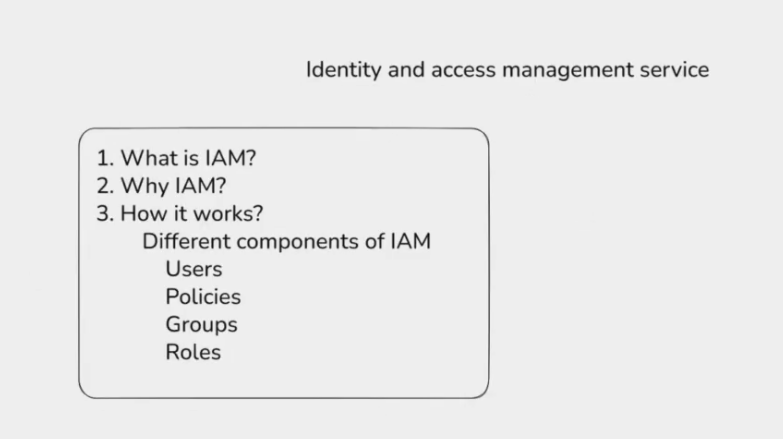

IAM means **Identity and Access Management**.

IAM is used to manage users, groups, roles, and permissions in AWS.

### IAM Main Parts

| Part | Meaning |
|------|---------|
| User | One person or application account. |
| Group | Collection of users with same permissions. |
| Role | Temporary permission given to AWS service or user. |
| Policy | JSON document that defines allowed or denied actions. |

### Example
- IAM user logs in to AWS.
- IAM policy allows `ec2:StartInstances`.
- Same policy may deny `ec2:TerminateInstances`.

> Simple idea: **IAM controls who can access AWS and what actions they can perform.**

user by no permission can not doing anything only login but we can add it to group which have permission

roles are between two aws services or user tempory
ROLES DEPTH?

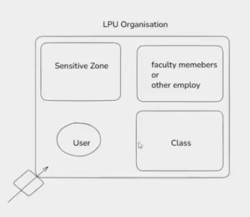
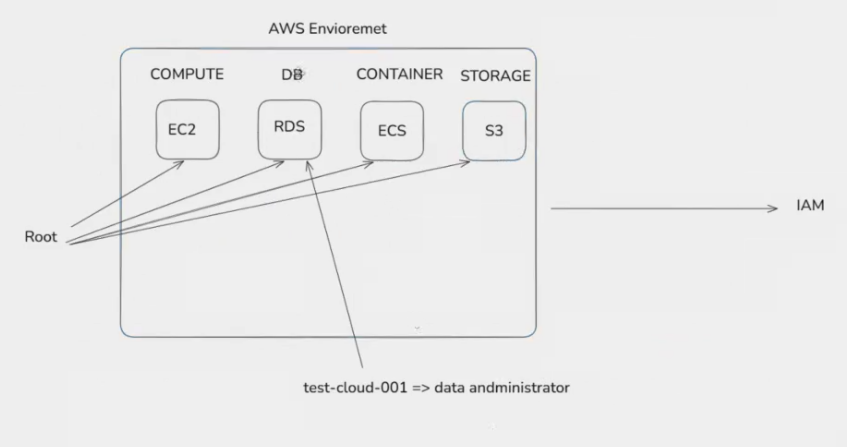
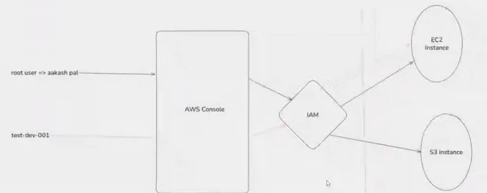

EC2 - ram cpu, networl, storage
pay as you go model

imp => ec2 instance types
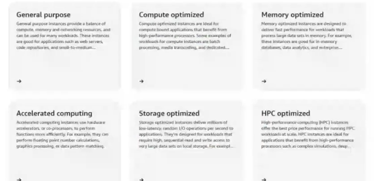