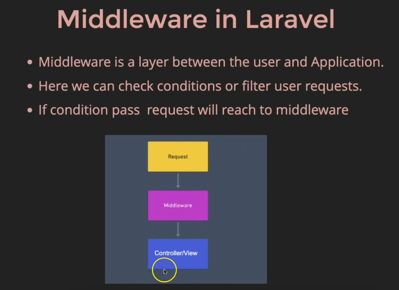
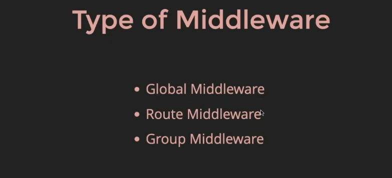
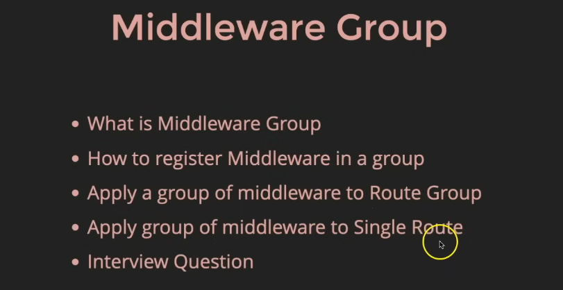
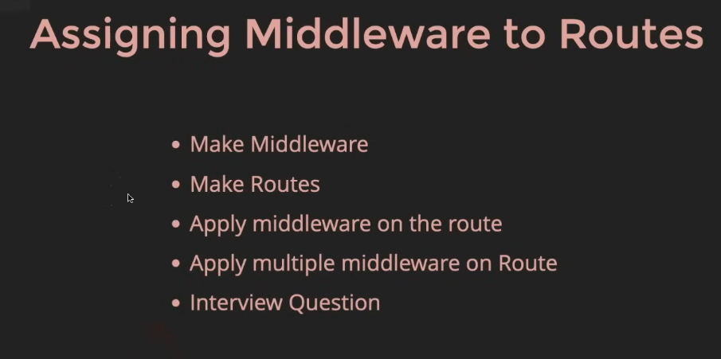
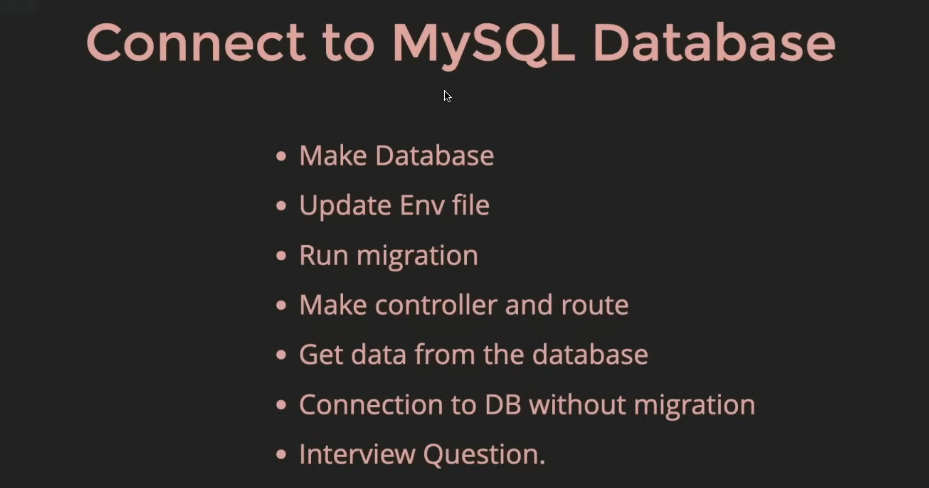
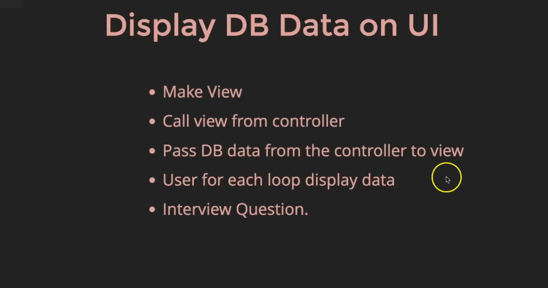
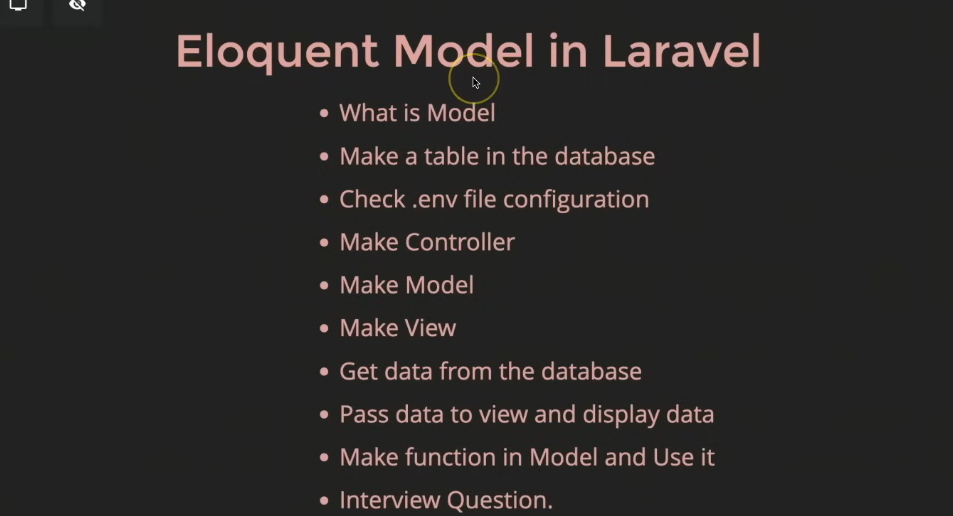
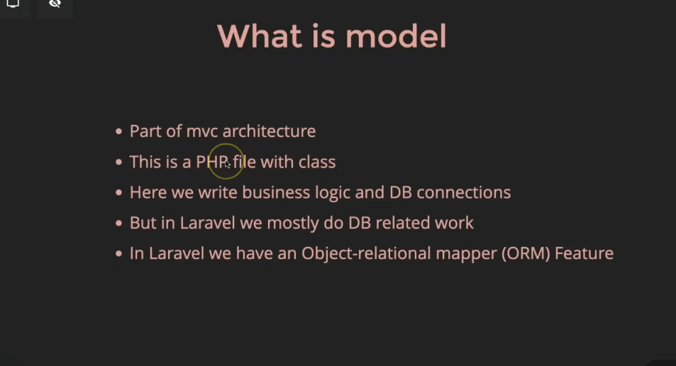
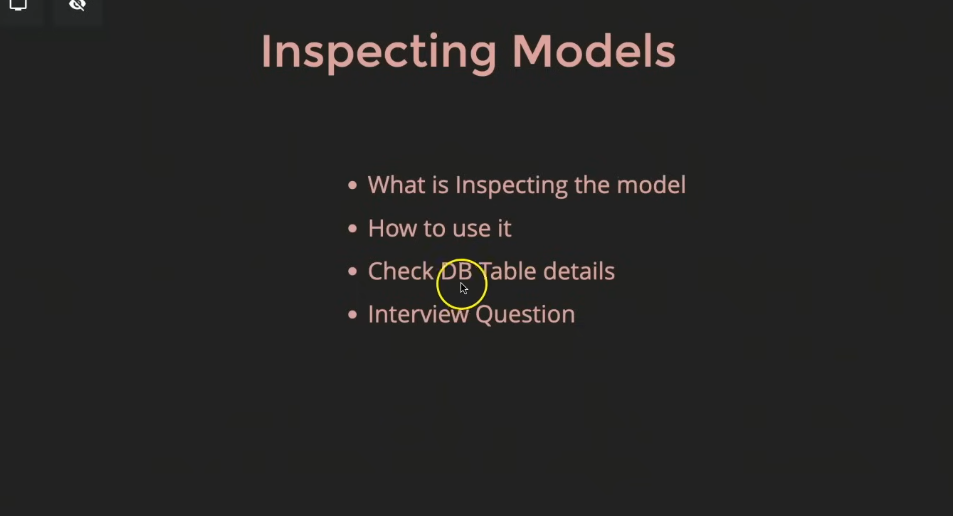

composer.json - all detail and dependency - imp file
composer.lock - it store all dependency hierarchy like one dependency can has many more dependency
vendor folder - all dependency are store here
app folder - core code it has modal, controller, middleware, service provider
routes folder - web - for web routes, console for cli 
resources folder - it has views folder 
config folder - has all config like database connection info
database folder - has migration, seeders, factories
public folder - first file to execute is index.php is inside it, icon , robot.txt
storage folder - for store pdf etc, logs, cache
test folder - it use for testing unit, modal   testing
vite config - create a local developemnt server

Routing in laravel
routing - it a path to opening a web page

controller 

view

blade template

php artisan puplish lang
can chnage message from validation for whole
lang -> validation.php 

custom rule

php artisan make:rule Uppercase 

middleware

connect to mysql

eloquent model in laravel

if model and table do not match the in model do this
protected $table = "give the table name";

php artisan model:show student(modelname)
give all the info 